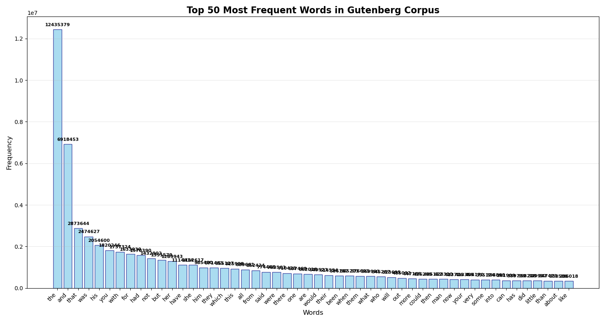
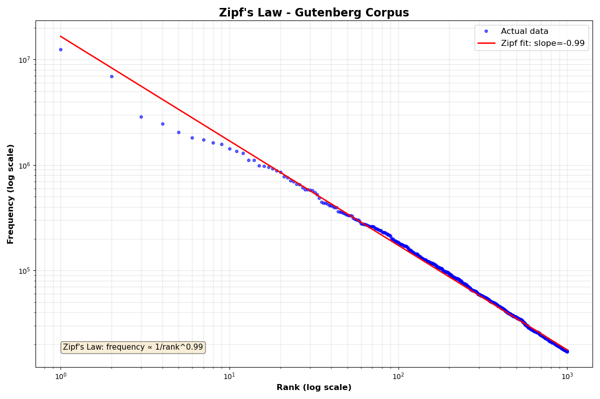
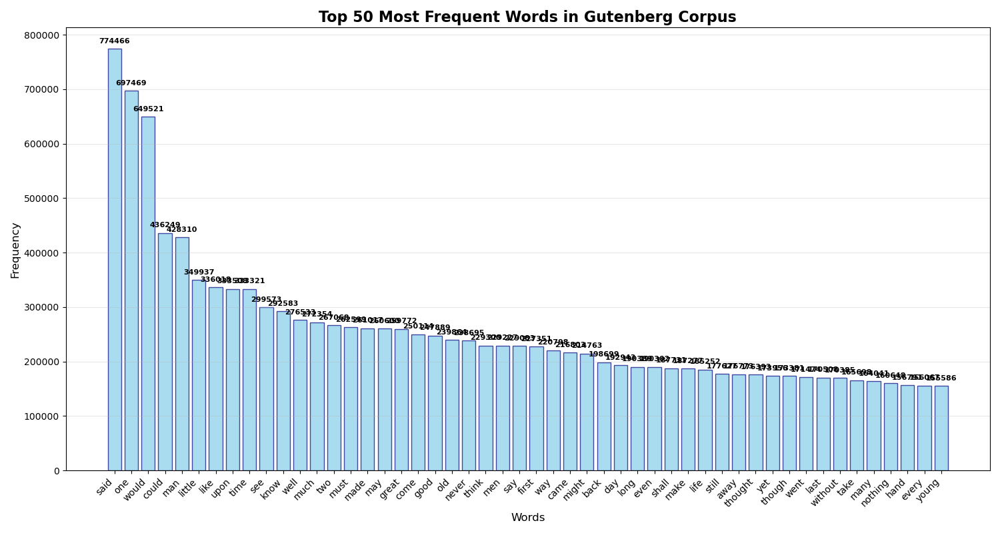
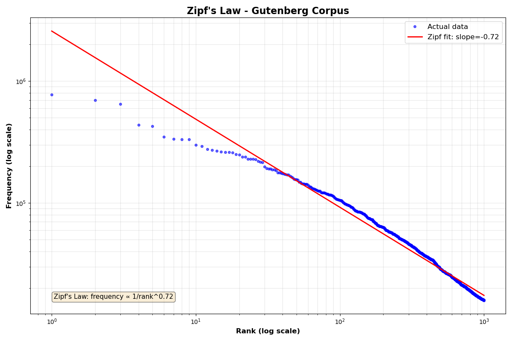

# Zipf's Law Analysis: Gutenberg Corpus Results

## Overview

This document presents the results of analyzing a large collection of texts from the **Gutenberg Corpus** to demonstrate **Zipf's Law** in natural language. The analysis processed hundreds of text files from Project Gutenberg, containing millions of words across various literary works, to examine word frequency distributions.

## What is Zipf's Law?

**Zipf's Law** is a fundamental empirical observation about natural language discovered by linguist George Kingsley Zipf in 1935. It states that in any large corpus of text, the frequency of any word is inversely proportional to its rank in the frequency table:

**frequency ∝ 1/rank^α**

Where α (the exponent) is typically close to 1.0 for natural language. When plotted on a log-log scale, this relationship appears as a straight line with slope ≈ -1.

## Corpus Details

The analysis was conducted on the complete Gutenberg corpus available in the `data/Gutenberg/txt` folder, which includes:
- Hundreds of literary texts
- Multiple genres (fiction, non-fiction, poetry)
- Various authors and time periods
- Millions of words in total

## Results

The analysis produced four visualization files demonstrating Zipf's Law under different conditions.

### Word Frequency Distribution (Without Stopwords)



Bar chart showing the top 300 most frequent content words after removing stopwords.

### Zipf's Law Analysis (Without Stopwords)



Log-log plot demonstrating Zipf's Law for content words (slope: -0.72).

### Word Frequency Distribution (With Stopwords)



Bar chart showing the top 300 most frequent words including function words.

### Zipf's Law Analysis (With Stopwords)



Log-log plot demonstrating Zipf's Law for all words (slope: -0.99).

## Key Findings

### Analysis WITH Stopwords

**Results shown in:** `gutenberg-stopwords-freq.png` and `zip-stopwords.png`

- **Slope: -0.99** (nearly perfect Zipf's Law!)
- **Top words**: Function words dominate the distribution
  - Rank 1 - "the": 12,435,379 occurrences
  - Rank 2 - "and": 6,918,453 occurrences
  - Rank 3 - "that": 2,873,644 occurrences
  - Rank 4 - "was": 2,474,627 occurrences
  - Rank 5 - "his": 2,054,600 occurrences
  - Rank 10 - "not": 1,432,902 occurrences
  - Rank 20 - "from": 852,424 occurrences
  - Rank 50 - "like": 336,018 occurrences
  - Rank 100 - "life": 185,252 occurrences
- **Cumulative frequency of top 100 words**: 72,737,378 occurrences
  - **Percentage of top 1000 words**: 63.86%
  - This means the top 100 words account for nearly two-thirds of all occurrences in the top 1000 most frequent words
- **Interpretation**: The complete linguistic distribution, including grammatical structure, strongly follows the power law
- **Fit quality**: Excellent fit across the entire range, especially smooth for ranks 10-1000, with only slight deviation at extreme ranks

### Analysis WITHOUT Stopwords

**Results shown in:** `gutenberg-no-stopwords-freq.png` and `zip-stopword.png`

- **Slope: -0.72** (flatter distribution)
- **Top content words**: After removing stopwords, meaningful words emerge
  - Rank 21 - "said": 774,466 occurrences (most frequent content word)
  - Rank 24 - "one": 697,469 occurrences
  - Rank 26 - "would": 649,521 occurrences
  - Rank 36 - "could": 436,249 occurrences
  - Rank 38 - "man": 428,310 occurrences
  - Rank 52 - "time": 333,321 occurrences
- **Interpretation**: Content vocabulary has a more uniform distribution, with many words used at moderate frequencies. Authors require varied vocabulary to express diverse ideas and concepts.
- **Fit quality**: Weaker fit compared to stopwords included, with more variance particularly at lower ranks

## Why Does Stopword Removal Change the Slope?

This difference reveals fundamental aspects of language structure:

1. **Function words** (stopwords) follow an extreme power law—a few words appear constantly
2. **Content words** have a flatter distribution—authors need varied vocabulary to express diverse ideas
3. **The -0.72 slope** suggests content words follow a "dampened" Zipf distribution, closer to the **Zipfian-Mandelbrot law**

## Statistical Significance

These results confirm well-established linguistic patterns:

- **Natural language isn't random**: Random word usage would produce a much flatter distribution
- **Efficiency principle**: This distribution may reflect optimal communication—balancing speaker effort (reusing common words) with listener understanding (maintaining vocabulary variety)
- **Universal pattern**: Despite spanning hundreds of texts, authors, and genres, the pattern holds consistently

## Running the Analysis

The analysis script `zipfs-law.py` is configurable via the `conf.txt` file, allowing you to select which corpus to analyze.

### Configuration

Edit the `conf.txt` file in the `src/tokenization/` directory to specify which corpus to process:

```
corpus=gutenberg
```

**Available corpus options:**
- `corpus=gutenberg` - Analyzes the complete Gutenberg corpus (hundreds of texts)
- `corpus=manzoni` - Analyzes "I Promessi Sposi" by Alessandro Manzoni
- `corpus=wallace` - Analyzes "Infinite Jest" by David Foster Wallace
- `corpus=shakespeare` - Analyzes Shakespeare texts from NLTK's Gutenberg collection

### Running the Script

```bash
python src/tokenization/zipfs-law.py
```

The script will:
1. Read the corpus selection from `conf.txt`
2. Load and process the specified corpus
3. Generate word frequency analysis
4. Create visualizations (bar charts and Zipf's Law plots)
5. Print the top 1000 most frequent words

## Viewing the Results

All visualization files are located in the `src/tokenization/` directory:

- **Frequency bar charts** show the top 300 most frequent words
- **Zipf's Law plots** display log-log graphs with fitted power-law curves, including the calculated slope

The visualizations clearly demonstrate that:
1. Natural language follows predictable statistical patterns
2. The inclusion or exclusion of stopwords significantly affects the distribution shape
3. Even with varied authors and genres, Zipf's Law remains remarkably consistent

---

## Relation between Zipf's Law and Tokenization

Zipf's Law states that word frequency in natural language follows a power-law distribution: a few words occur very often, while most appear rarely.
Tokenization methods, such as Byte Pair Encoding (BPE) or WordPiece, are designed with this principle in mind. 
They represent frequent words as single tokens and decompose rare words into subword units.
This approach balances vocabulary size, efficiency, and the ability to handle unseen words—making language models more compact and generalizable.

**Conclusion**: This analysis of the Gutenberg corpus elegantly demonstrates one of linguistics' most robust statistical laws. The near-perfect -0.99 slope with stopwords validates decades of research, while the -0.72 slope without stopwords reveals the different statistical nature of grammatical versus semantic vocabulary.
